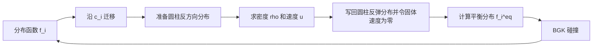

# LBM 原理与 `my_lbm.py` 代码说明

本文解释 [`my_lbm.py`](./my_lbm.py) 使用的格子玻尔兹曼方法（Lattice Boltzmann Method，LBM），并把主要公式与代码逐段对应起来。

这个程序模拟的是一个二维流场：流体初始向右运动，经过计算域左侧四分之一处的固定圆柱。程序显示速度大小

\[
|\boldsymbol{u}|=\sqrt{u_x^2+u_y^2}.
\]

需要先明确：程序没有设置持续的入口速度或体积力。向右流动只由初始分布函数产生，而圆柱会不断从流体中吸收动量。因此它更准确地说是**周期计算域中、初始向右流动经过圆柱并逐渐衰减的瞬态算例**，不是具有恒定入口的稳态圆柱绕流。

## 1. LBM 在计算什么

传统 CFD 通常直接离散并求解连续介质的 Navier–Stokes 方程。LBM 使用一种介观描述：在每个网格点保存若干个沿离散方向运动的粒子分布函数

\[
f_i(\boldsymbol{x},t),\qquad i=0,1,\ldots,8.
\]

`f_i` 不是第 `i` 个真实粒子的轨迹，而是该位置沿第 `i` 个离散方向运动的统计分布。每个时间步主要完成两件事：

1. **碰撞（collision）**：同一网格点上的分布向局部平衡态松弛；
2. **迁移（streaming）**：碰撞后的分布沿各自方向移动到相邻网格点。

本程序在循环中采用“先迁移、后碰撞”的等价排列，并在两者之间处理圆柱边界和计算宏观量。



经过 Chapman–Enskog 多尺度展开，在低马赫数、近似不可压缩条件下，这套离散演化可以恢复 Navier–Stokes 方程。因此，LBM 特别适合具有大量复杂固体边界的孔隙流动。

## 2. D2Q9 离散速度模型

程序使用 **D2Q9** 模型：

- `D2` 表示二维空间；
- `Q9` 表示每个网格点有 9 个离散速度方向。

代码中的方向编号为：

| 编号 `i` | `cx` | `cy` | 方向 | 权重 `w_i` | 反方向 |
|---:|---:|---:|---|---:|---:|
| 0 | 0 | 0 | 静止 | \(4/9\) | 0 |
| 1 | 0 | 1 | 上 | \(1/9\) | 5 |
| 2 | 1 | 1 | 右上 | \(1/36\) | 6 |
| 3 | 1 | 0 | 右 | \(1/9\) | 7 |
| 4 | 1 | -1 | 右下 | \(1/36\) | 8 |
| 5 | 0 | -1 | 下 | \(1/9\) | 1 |
| 6 | -1 | -1 | 左下 | \(1/36\) | 2 |
| 7 | -1 | 0 | 左 | \(1/9\) | 3 |
| 8 | -1 | 1 | 左上 | \(1/36\) | 4 |

对应代码：

```python
NL = 9
cxs = np.array([0, 0, 1, 1, 1, 0, -1, -1, -1])
cys = np.array([0, 1, 1, 0, -1, -1, -1, 0, 1])
weights = np.array([4/9, 1/9, 1/36, 1/9, 1/36,
                    1/9, 1/36, 1/9, 1/36])
```

离散速度记作

\[
\boldsymbol{c}_i=(c_{ix},c_{iy}).
\]

静止方向、轴向方向和对角方向的权重不同，这些权重使离散模型具有足够的旋转对称性，从而正确恢复各向同性的流体方程。

## 3. 从分布函数得到密度和速度

宏观密度是九个分布函数的零阶矩：

\[
\rho(\boldsymbol{x},t)=\sum_i f_i(\boldsymbol{x},t).
\]

动量是分布函数的一阶矩：

\[
\rho\boldsymbol{u}=\sum_i f_i\boldsymbol{c}_i.
\]

所以速度为

\[
u_x=\frac{\sum_i f_i c_{ix}}{\rho},\qquad
u_y=\frac{\sum_i f_i c_{iy}}{\rho}.
\]

代码利用 NumPy 广播一次完成所有方向的求和：

```python
rho = np.sum(F, axis=2)
ux = np.sum(F * cxs, axis=2) / rho
uy = np.sum(F * cys, axis=2) / rho
```

其中 `F.shape == (Ny, Nx, 9)`：前两维是空间，最后一维是离散速度方向。

在等温 D2Q9 模型中，格子声速满足

\[
c_s^2=\frac{1}{3},
\]

压力与密度的关系为

\[
p=c_s^2\rho=\frac{\rho}{3}.
\]

这说明当前程序虽然没有显式保存压力数组，仍然可以从密度计算格子单位下的压力。

## 4. 局部平衡分布

碰撞步骤需要计算二阶低马赫数平衡分布：

\[
f_i^{\mathrm{eq}}
=w_i\rho\left[
1+\frac{\boldsymbol{c}_i\cdot\boldsymbol{u}}{c_s^2}
+\frac{(\boldsymbol{c}_i\cdot\boldsymbol{u})^2}{2c_s^4}
-\frac{\boldsymbol{u}\cdot\boldsymbol{u}}{2c_s^2}
\right].
\]

代入 \(c_s^2=1/3\) 后得到程序中的形式：

\[
f_i^{\mathrm{eq}}
=w_i\rho\left[
1+3(\boldsymbol{c}_i\cdot\boldsymbol{u})
+\frac{9}{2}(\boldsymbol{c}_i\cdot\boldsymbol{u})^2
-\frac{3}{2}|\boldsymbol{u}|^2
\right].
\]

```python
Feq[:, :, i] = rho * w * (
    1
    + 3 * (cx * ux + cy * uy)
    + 9/2 * (cx * ux + cy * uy) ** 2
    - 3/2 * (ux ** 2 + uy ** 2)
)
```

这个展开假设马赫数足够低，通常希望

\[
Ma=\frac{|\boldsymbol{u}|}{c_s}\lesssim 0.1.
\]

速度过大时，密度波动和可压缩误差会增加，BGK 模型也更容易不稳定。

## 5. BGK 碰撞与松弛时间

程序使用单松弛时间 BGK 碰撞模型：

\[
f_i^*(\boldsymbol{x},t)
=f_i(\boldsymbol{x},t)
-\frac{1}{\tau}
\left[f_i(\boldsymbol{x},t)-f_i^{\mathrm{eq}}(\boldsymbol{x},t)\right].
\]

其中 \(f_i^*\) 是碰撞后的分布，`tau` 是松弛时间。代码写成原地更新：

```python
F += -(1 / tau) * (F - Feq)
```

在格子单位 \(\Delta x=\Delta t=1\) 下，运动黏度为

\[
\nu=c_s^2\left(\tau-\frac{1}{2}\right)
=\frac{1}{3}\left(\tau-\frac{1}{2}\right).
\]

本程序设置 `tau = 0.53`，所以

\[
\nu=\frac{0.53-0.5}{3}=0.01.
\]

必须满足 \(\tau>0.5\) 才有正黏度。`tau` 越接近 `0.5`，黏度越小、可能达到的雷诺数越高，但数值稳定裕量也越小。

若取圆柱直径 \(D=26\) 和特征速度 \(U\)，雷诺数为

\[
Re=\frac{UD}{\nu}.
\]

当前初始化产生的平均向右速度约为 `0.126`，对应初始 \(Ma\approx0.22\)、\(Re\approx328\)。这已经超出常用的低马赫数经验范围，而且 `tau` 很接近稳定下限，所以该程序主要适合作为算法演示，不适合作为未经验证的定量计算结果。

## 6. 迁移步骤与外边界

LBM 的迁移方程为

\[
f_i(\boldsymbol{x}+\boldsymbol{c}_i,t+1)=f_i^*(\boldsymbol{x},t).
\]

代码对每个方向移动整个二维数组：

```python
for i, cx, cy in zip(range(NL), cxs, cys):
    F[:, :, i] = np.roll(F[:, :, i], cx, axis=1)
    F[:, :, i] = np.roll(F[:, :, i], cy, axis=0)
```

- `axis=1` 对应水平方向 `x`；
- `axis=0` 对应竖直方向 `y`；
- 正 `cx` 向右移动，正 `cy` 向下标增大的方向移动。绘图时数组第 0 行默认在图像上方，因此代码中的正 `y` 在图上看起来向下。

`np.roll` 会把从一端移出的值放回另一端，因此它隐式施加了：

\[
f_i(0,y)=f_i(N_x,y),\qquad
f_i(x,0)=f_i(x,N_y),
\]

即左右和上下都是周期边界。这里没有速度入口、压力出口或上下固壁。

## 7. 圆柱与反弹边界

圆柱中心为

\[
(x_c,y_c)=\left(\frac{N_x}{4},\frac{N_y}{2}\right)=(100,50),
\]

半径为 13 个格点：

```python
cylinder = np.full((Ny, Nx), False)

for y in range(Ny):
    for x in range(Nx):
        if distance(x, y, Nx // 4, Ny // 2) < 13:
            cylinder[y, x] = True
```

`cylinder` 是布尔掩膜，`True` 表示固体格点。

固体表面使用反弹（bounce-back）边界。到达固体节点的分布函数被换到相反方向：

\[
f_i\leftarrow f_{\bar{i}}.
\]

程序中的反方向映射是：

```python
[0, 5, 6, 7, 8, 1, 2, 3, 4]
```

也就是

```text
0 ↔ 0
1 ↔ 5
2 ↔ 6
3 ↔ 7
4 ↔ 8
```

对应代码：

```python
bndryF = F[cylinder, :]
bndryF = bndryF[:, [0, 5, 6, 7, 8, 1, 2, 3, 4]]
...
F[cylinder, :] = bndryF
ux[cylinder] = 0
uy[cylinder] = 0
```

反弹使圆柱处满足近似无滑移条件。将固体区域的 `ux`、`uy` 设为零，既表达了固定固体速度，也避免绘图时圆柱内部出现非零速度。

当前写法属于简化的格点反弹实现，而且碰撞仍对固体节点执行。它适合教学演示；若要精确计算阻力、涡脱落频率或渗透率，通常会只对流体节点碰撞，并采用经过验证的半格点反弹或曲面边界格式。

## 8. 初始条件的含义

程序首先给九个方向接近 1 的随机分布：

```python
F = np.ones((Ny, Nx, NL)) + 0.01 * np.random.randn(Ny, Nx, NL)
```

随机扰动可以破坏严格对称性，使尾流中的不稳定结构更容易出现。但没有固定随机种子，因此每次运行结果会略有不同。

随后把向右方向 `i=3` 设置为 2.3：

```python
F[:, :, 3] = 2.3
```

因为 `i=3` 的速度是 `(1, 0)`，这会产生正的水平动量。忽略随机扰动时：

\[
\rho\approx 8\times1+2.3=10.3,
\]

\[
u_x\approx\frac{2.3-1}{10.3}\approx0.126,
\qquad u_y\approx0.
\]

不过，这组 `F` 并不是根据给定 \(\rho\) 和 \(\boldsymbol{u}\) 构造的平衡分布，因此开始阶段会产生额外的松弛瞬态和密度波。更标准的初始化方式是先指定 `rho0`、`ux0`、`uy0`，再用平衡分布公式设置 `F = Feq(rho0, ux0, uy0)`。

## 9. 主循环逐段解释

### 9.1 参数

```python
Nx = 400
Ny = 100
tau = 0.53
Nt = 3000
```

- `Nx`、`Ny`：横向和纵向格点数；
- `tau`：BGK 松弛时间，决定运动黏度；
- `Nt`：时间步数。LBM 使用格子单位，`Nt=3000` 本身不等于 3000 秒。

### 9.2 迁移

```python
for i, cx, cy in zip(range(NL), cxs, cys):
    F[:, :, i] = np.roll(F[:, :, i], cx, axis=1)
    F[:, :, i] = np.roll(F[:, :, i], cy, axis=0)
```

第 `i` 个分布沿第 `i` 个离散速度移动一个格点。

### 9.3 保存反弹后的分布

```python
bndryF = F[cylinder, :]
bndryF = bndryF[:, [0, 5, 6, 7, 8, 1, 2, 3, 4]]
```

先提取迁移到圆柱节点的分布，再交换相反方向，为反弹做准备。

### 9.4 计算宏观变量

```python
rho = np.sum(F, axis=2)
ux = np.sum(F * cxs, axis=2) / rho
uy = np.sum(F * cys, axis=2) / rho
```

对离散方向求零阶矩和一阶矩，恢复密度及速度。

### 9.5 应用固体边界

```python
F[cylinder, :] = bndryF
ux[cylinder] = 0
uy[cylinder] = 0
```

用反方向分布覆盖圆柱节点，并将固体速度清零。

### 9.6 计算平衡态并碰撞

```python
Feq = np.zeros(F.shape)
for i, cx, cy, w in zip(range(NL), cxs, cys, weights):
    Feq[:, :, i] = ...

F += -(1 / tau) * (F - Feq)
```

所有分布函数以 `1/tau` 的速率向局部平衡分布松弛。

### 9.7 显示速度大小

```python
plt.imshow(np.sqrt(ux ** 2 + uy ** 2))
plt.pause(0.01)
plt.cla()
```

每 100 步绘制一次速度模。这里没有固定颜色范围，所以 Matplotlib 每帧可能自动改变色标；不同帧的颜色不一定代表相同的绝对速度。

## 10. 数组尺寸和广播规则

理解数组形状有助于读懂这段 NumPy 代码：

| 变量 | 形状 | 含义 |
|---|---|---|
| `F` | `(Ny, Nx, 9)` | 九个方向的分布函数 |
| `Feq` | `(Ny, Nx, 9)` | 九个方向的平衡分布 |
| `rho` | `(Ny, Nx)` | 密度场 |
| `ux`, `uy` | `(Ny, Nx)` | 速度分量 |
| `cxs`, `cys` | `(9,)` | 离散速度分量 |
| `weights` | `(9,)` | D2Q9 权重 |
| `cylinder` | `(Ny, Nx)` | 固体布尔掩膜 |

在 `F * cxs` 中，NumPy 自动把 `(9,)` 对齐到 `F` 的最后一维，因此每个方向的分布函数都会乘以相应的 `cx`。

## 11. 从格子单位换算到物理单位

程序中的长度、时间、速度和黏度都是格子单位。若指定一个格点对应的物理长度 \(\Delta x_{phys}\)，并希望物理运动黏度为 \(\nu_{phys}\)，则由扩散尺度相似关系：

\[
\nu_{phys}=\nu_{LB}\frac{\Delta x_{phys}^2}{\Delta t_{phys}},
\]

可得到

\[
\Delta t_{phys}
=\nu_{LB}\frac{\Delta x_{phys}^2}{\nu_{phys}}.
\]

因此，只有在给定空间分辨率、物理黏度和无量纲相似条件后，`Nt` 才能换算成真实秒数：

\[
t_{phys}=N_t\Delta t_{phys}.
\]

不能直接把一次 LBM 迭代解释为一秒。

## 12. 当前程序的边界条件总结

| 位置 | 当前处理 |
|---|---|
| 左边界 | 周期边界 |
| 右边界 | 周期边界 |
| 上边界 | 周期边界 |
| 下边界 | 周期边界 |
| 圆柱 | 反弹无滑移边界 |
| 流动驱动 | 初始向右动量，没有持续驱动力 |

因此，图像不应解释为带有固定入口速度和出口压力的风洞圆柱绕流结果。

## 13. 用于定量模拟前需要改进的地方

如果要把这个教学示例用于论文数据生成或与 XLB 对比，至少应处理以下问题：

1. **用平衡分布初始化**，减少非物理密度波；
2. **降低马赫数**，一般将最大格子速度控制在约 `0.05` 左右；
3. **明确驱动方式**：使用恒定体积力，或设置速度入口和压力出口；
4. **明确上下边界**：根据问题选择周期边界或无滑移固壁；
5. **只在流体节点碰撞**，避免固体内部的无意义更新；
6. **验证网格无关性**，增加圆柱直径对应的格点数；
7. **验证质量守恒**，监控总质量和密度波动；
8. **检查收敛或统计稳态**，不能只依据动态图像判断；
9. **固定绘图色标并输出矢量/流线图**，同时检查 `ux`、`uy` 的方向；
10. **与基准量比较**，例如阻力系数、Strouhal 数或已知解析渗透率。

## 14. 与多孔介质渗流的关系

把单个圆柱掩膜替换成数字岩心或随机颗粒掩膜后，同一套 D2Q9 流程就可以用于二维孔隙尺度渗流：

```text
孔隙结构掩膜
    → LBM 达到稳态
    → 得到 rho、ux、uy
    → 对截面速度积分得到 Darcy 通量
    → 根据压力梯度和黏度计算渗透率
```

对于单相流，沿 `x` 方向的 Darcy 定律为

\[
q_x=-\frac{k_x}{\mu}\frac{\Delta p}{L_x},
\]

因此

\[
k_x=-\frac{\mu q_x L_x}{\Delta p}.
\]

当前程序没有稳定的压力差或体积力，因此不能直接从这次圆柱绕流计算渗透率。要生成可用于 FNO 训练的渗流数据，应先建立明确的压力梯度或恒定体积力，并让流量达到稳定状态。
